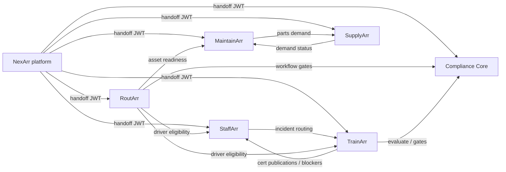

# STL Compliance / Arr Ecosystem — Final Implementation Report

**Program:** Workers W17–W94 (Arr ecosystem implementation)  
**Date:** 2026-05-27  
**Repository:** `STLComplianceV2`

This report synthesizes platform delivery from Worker 17 through Worker 94, including M13 ship-gate hardening (Workers 91–94). It is intended for engineering leads, deploy operators, and acceptance reviewers.

---

## Executive summary

The Arr suite is **functionally complete at the API and integration layer** across seven product APIs, eight React frontends (suite + six products + companion), shared workers, NexArr platform spine, and Render V1 Blueprint infrastructure. **575 automated .NET tests** pass in Release configuration (excluding optional `Category=Live` probes). Cross-product journeys are covered by `STLCompliance.E2E` integration tests and OpenAPI snapshot parity gates.

**Remaining ship-gate items** are environmental or operational: live browser E2E full nightly pass (harness expanded W101), load/SLO validation (blocked on PO SLOs), staging Render snapshot DR drill (operator scripts; nightly covers docker-compose seven DBs per W102), and multi-tenant soak testing. A Playwright harness exists (`tests/e2e-playwright`) with **compose e2e profile** and six-product handoff smokes; tests **skip cleanly** when `E2E_LIVE` is unset or services are down.

---

## Milestone status

| Milestone | Status | Workers (representative) |
|-----------|--------|--------------------------|
| **M1** — Render & repo foundation | **Complete** | W1, W89 |
| **M2** — NexArr platform access spine | **Partial → feature-complete** | W2–4, W6 |
| **M3** — Suite frontend & design system | **Partial** | W5–8, W88; Playwright scaffold W94 |
| **M4** — StaffArr workforce spine | **In progress → slice-complete** | W9–21, W46, W48–49 |
| **M5** — Compliance Core vocabulary & rules | **In progress → slice-complete** | W23–35, W37, W39, W41, W43, W45, W47 |
| **M6** — TrainArr qualification spine | **In progress → slice-complete** | W22, W27–33, W36, W38, W40, W42, W44 |
| **M7** — MaintainArr maintenance spine | **In progress → slice-complete** | W50–61, W51, W57 |
| **M8** — SupplyArr procurement spine | **In progress → slice-complete** | W62–68, W73, W75, W77, W79, W81, W83, W85 |
| **M9** — RoutArr dispatch spine | **In progress → slice-complete** | W69–72, W74, W76, W78, W80, W82, W84, W86–87 |
| **M10** — Cross-product qualification gates | **In progress → slice-complete** | W36–42, W83–87 |
| **M11** — Companion app | **Partial** | W90 |
| **M12** — Scheduled workers | **In progress** | W44, W46–51, shared-worker jobs |
| **M13** — Ship-gate acceptance & hardening | **Partial** | W91–94 |

---

## Products delivered

| Product | API port (local) | Frontend port (local) | Core capabilities |
|---------|------------------|----------------------|-------------------|
| **NexArr** | 5101 | — (suite 5174 proxies) | Auth, sessions, tenants, entitlements, launch/handoff, platform admin, companion inbox aggregation, **platform health** |
| **StaffArr** | 5102 | 5175 | People, org hierarchy, roles/permissions, certifications, readiness, incidents, timeline, training blockers, workers |
| **TrainArr** | 5103 | 5176 | Assignments, programs, evidence, signoffs, qualifications, checks, citations, rule-pack impact, expiration worker |
| **MaintainArr** | 5104 | 5177 | Assets, PM, inspections, defects, work orders, meters, history, readiness, labor/evidence |
| **RoutArr** | 5105 | 5180 | Trips, routes, dispatch board/calendar, availability, DnD/bulk assign, closeout, eligibility, workflow gates |
| **SupplyArr** | 5106 | 5178 | Vendors, parts, inventory, PR/PO/receiving, exceptions, backorders, returns, snapshots, reorder, MaintainArr demand |
| **Compliance Core** | 5107 | 5179 | Vocabulary, registries, mappings, evaluation, findings, gates, 9-CSV, audit export, dashboards, scheduled evaluation |
| **Suite** | — | 5174 | AppShell, dashboard, product surfaces, platform admin UI |
| **Companion** | — | (static) | Field inbox, NexArr handoff auth |

Each product API: EF Core + PostgreSQL, JWT + service-token auth, `/health` + `/health/ready`, OpenAPI in Testing, audit events on mutating operations.

---

## Cross-product integration map



**E2E integration flows** (`STLCompliance.E2E`, W91): NexArr handoff redeem; StaffArr readiness; TrainArr assignment complete → StaffArr cert; MaintainArr work-order lifecycle; RoutArr dispatch with Compliance Core gate block/override.

---

## Security & permissions

- **User auth:** NexArr issues JWTs; product APIs validate issuer/audience via shared `stl-auth` env group (`AUTH_SIGNING_KEY`, `Auth__Issuer`, `Auth__Audience`).
- **Service auth:** Scoped service tokens for cross-product and worker calls (`SERVICE_TOKEN_*`, per-scope claims documented in worker slices).
- **Tenant isolation:** All domain tables tenant-scoped; platform admin separated from tenant admin roles.
- **Handoff:** Short-lived codes, callback allowlists, launch context denial reason codes.
- **Secrets:** Render `generateValue` for signing keys; no secrets in repo; `.env` not committed.

Demo credentials (local seed): `admin@demo.stl` / `ChangeMe!Demo2026`, tenant `11111111-1111-1111-1111-111111111101`.

---

## Database schema (summary)

- **One PostgreSQL database per product** (`nexarr`, `staffarr`, `trainarr`, `maintainarr`, `routarr`, `supplyarr`, `compliancecore`), initialized via `docker/postgres/init-databases.sql`.
- **Migrations:** EF Core migrations per API under `apps/{product}-api/*/Migrations/`.
- **Cross-product references:** Integration tables (e.g. `staffarr_person_training_blockers`, `supplyarr_maintainarr_demand_refs`, `routarr_*` eligibility caches) use external IDs + service-token ingest, not cross-DB FKs.
- **Workers:** Materialized rollups/projections (`staffarr_readiness_rollups`, `staffarr_person_permission_projections`, scheduled evaluation runs, etc.).

---

## Build & test commands

### .NET (CI default)

```powershell
dotnet build STLCompliance.slnx -c Release
dotnet test STLCompliance.slnx -c Release --filter "Category!=Live"
```

**Worker 94 result:** **575 passed**, 0 failed, 0 skipped (Live category excluded).

| Test project | Passed |
|--------------|--------|
| STLCompliance.StaffArr.Auth.Tests | 114 |
| STLCompliance.RoutArr.Auth.Tests | 95 |
| STLCompliance.MaintainArr.Auth.Tests | 84 |
| STLCompliance.ComplianceCore.Auth.Tests | 73 |
| STLCompliance.Shared.Worker.Tests | 93 |
| STLCompliance.NexArr.Auth.Tests | 45 |
| STLCompliance.SupplyArr.Auth.Tests | 35 |
| STLCompliance.OpenApi.Tests | 14 |
| STLCompliance.Health.Tests | 14 |
| STLCompliance.E2E (Integration) | 8 |

*TrainArr-specific auth tests are embedded in cross-product suites (StaffArr, RoutArr, E2E) — no standalone `TrainArr.Auth.Tests` project.*

### Optional live API smoke

```powershell
docker compose up -d postgres nexarr-api staffarr-api trainarr-api maintainarr-api routarr-api supplyarr-api compliancecore-api
$env:E2E_LIVE = "1"
dotnet test tests/STLCompliance.E2E/STLCompliance.E2E.csproj -c Release --filter "Category=Live"
```

### Browser E2E (Playwright, W94 + W101)

```powershell
./scripts/ops/e2e-stack-up.ps1
./scripts/ops/e2e-frontends-preview.ps1
cd tests/e2e-playwright; npm install; npx playwright install chromium
$env:E2E_LIVE = "1"; npm test
```

Optional full containerized frontends: `./scripts/ops/e2e-stack-up.ps1 -BuildFrontends` (uses `docker-compose.e2e.yml` profile `e2e`).

Without `E2E_LIVE`: all specs skipped (exit 0). With `E2E_LIVE` but stack down: skipped per `beforeEach` / per-product probes.

### Optional DR restore drill (W99 + W102 + W103)

```powershell
# Unit checks (CI default)
dotnet test tests/STLCompliance.Dr.Tests/STLCompliance.Dr.Tests.csproj -c Release --filter "Category=Dr&Category!=Live"

# Live restore drill for all seven product databases (docker-compose postgres + APIs)
docker compose up -d postgres nexarr-api staffarr-api trainarr-api maintainarr-api routarr-api supplyarr-api compliancecore-api
$env:DR_LIVE = "1"
dotnet test tests/STLCompliance.Dr.Tests/STLCompliance.Dr.Tests.csproj -c Release --filter "Category=Dr&Category=Live"

# Operator full drill (backups directory with *.custom|*.dump|*.sql per database)
./scripts/ops/dr-restore-drill.ps1 -BackupDirectory C:\backups\2026-05-27 -DockerContainerName stlcompliancev2-postgres-1

# Render staging snapshot drill (external URLs + pg_dump on PATH)
$env:RENDER_STAGING_NEXARR_DATABASE_URL = "postgresql://..."
./scripts/ops/render-staging-dr-restore-drill.ps1
```

### Optional load test (W100)

```powershell
# Unit checks (CI default)
dotnet test tests/STLCompliance.Load.Tests/STLCompliance.Load.Tests.csproj -c Release --filter "Category=Load&Category!=Live"

# Live k6 against docker-compose (requires k6 on PATH)
docker compose up -d postgres nexarr-api staffarr-api trainarr-api maintainarr-api routarr-api supplyarr-api compliancecore-api
$env:LOAD_LIVE = "1"
dotnet test tests/STLCompliance.Load.Tests/STLCompliance.Load.Tests.csproj -c Release --filter "Category=Load&Category=Live"

# Operator full harness (all three scenarios)
./scripts/ops/load-test-run.ps1
```

### Frontends

```powershell
# Per app: npm ci && npm run build && npm test
```

---

## Deployment readiness

| Area | Status | Notes |
|------|--------|-------|
| `render.yaml` Blueprint | Ready | 7 APIs, 8 static frontends, `shared-worker`, env groups, health checks |
| Internal service URLs | Ready | `stl-internal-api-urls` on private network :10000 |
| Public URLs / CORS | Configured | `stl-public-*` groups; update after custom domains |
| Platform health | Ready | `GET /api/platform/health` aggregates `/health/ready` (W93) |
| OpenAPI CI gate | Ready | 7 snapshots, `Category=OpenApi` (W92) |
| Docker local dev | Ready | `docker-compose.yml` APIs + postgres; frontends via Vite |
| OTEL / metrics dashboards | **Wired** — instrumentation + smoke checks; connect Render `OTEL_EXPORTER_OTLP_ENDPOINT` when backend available |
| Load / performance | **Harness ready (W100)** — k6 scenarios + SLO evaluator with engineering defaults; replace when PO publishes SLOs |
| DR / backup restore | **Nightly seven-DB drill (W102)** + **Render staging snapshot drill (W103)** — `render-staging-*` ops scripts, `dr-staging-render.yml` workflow_dispatch |
| Tenant isolation soak | Open | Per-slice deny tests only |
| STLComplianceSite (marketing) | Not started | M3 backlog |

---

## Blocked / open items (concrete reasons)

| Item | Blocker | Unblock path |
|------|---------|--------------|
| **Playwright full pass** | Harness + compose e2e profile (W101); nightly starts all previews via `e2e-frontends-preview.sh` | Run nightly workflow; fix flaky handoff tests if any product seed/entitlement gaps |
| **Load / performance** | Engineering-default SLO harness (W100) — replace thresholds when PO publishes SLO document | Product owners publish SLO targets; extend k6 to authenticated flows |
| **Metrics / tracing acceptance** | OTEL wired (W98); enable exporter on Render for dashboard validation | Enable OTEL on Render; run `scripts/ops/otel-smoke.ps1 -RequireOtelEnabled` |
| **DR verification** | **Nightly seven-DB drill (W102)** on docker-compose; **staging drill scripted (W103)** | Configure GitHub secrets + run `dr-staging-render` workflow or operator `render-staging-dr-restore-drill.*` |
| **Tenant soak** | No multi-tenant parallel E2E battery | Add `STLCompliance.E2E` tenant isolation suite |
| **TrainArr dedicated test project** | Coverage via cross-product tests only | Optional `STLCompliance.TrainArr.Auth.Tests` for parity |
| **STLComplianceSite** | Out of Arr worker scope | Separate marketing site milestone |
| **Companion offline/push** | Deferred W90 | Mobile platform features |

---

## Environment-only follow-ups (no code required in repo)

1. Set Render **custom domains** and update `stl-public-frontend-urls` / `stl-public-api-urls`.
2. Confirm **AUTH_SIGNING_KEY** rotation procedure across all services.
3. Wire **CI nightly**: `E2E_LIVE=1` + docker-compose + Playwright against staging URLs.
4. Enable **OTEL** and connect to observability backend when available.
5. Product owners publish **SLO document** to unblock load testing.

---

## Worker index (W17–W94)

| Range | Theme |
|-------|--------|
| W17–W21 | StaffArr readiness override, incidents, TrainArr blockers/routing, timeline |
| W22–W44 | TrainArr assignments/qualifications; Compliance Core spine; batch/workers |
| W45–W51 | Compliance dashboards; StaffArr/TrainArr/MaintainArr scheduled workers |
| W50–W61 | MaintainArr full maintenance lifecycle |
| W62–W68 | SupplyArr procurement chain |
| W69–W82 | RoutArr dispatch + SupplyArr extensions |
| W83–W87 | Cross-product demand, eligibility, dispatchability, workflow gates |
| W88–W90 | Suite shell, Render V1, Companion inbox |
| W91–W93 | E2E harness, OpenAPI parity, platform health |
| W94 | Playwright browser smoke scaffold + this report |
| W97–W103 | Handoff client dedup, OTEL smoke checks, DR restore drill, load-test harness, Playwright compose e2e profile, seven-database DR nightly drill, Render staging snapshot drill |

Detailed slice notes: `docs/implementation/worker-slices/W*.md` and `docs/implementation/worker-slices/00_SLICE_STATE.md`.

---

## Sign-off recommendation

**Approve for staged deployment** of APIs and frontends to Render with standard smoke checks (`/health`, `GET /api/platform/health`, integration E2E in CI). **Defer production sign-off** on performance, DR, and browser E2E until the blocked items above have owners and scheduled runs.
